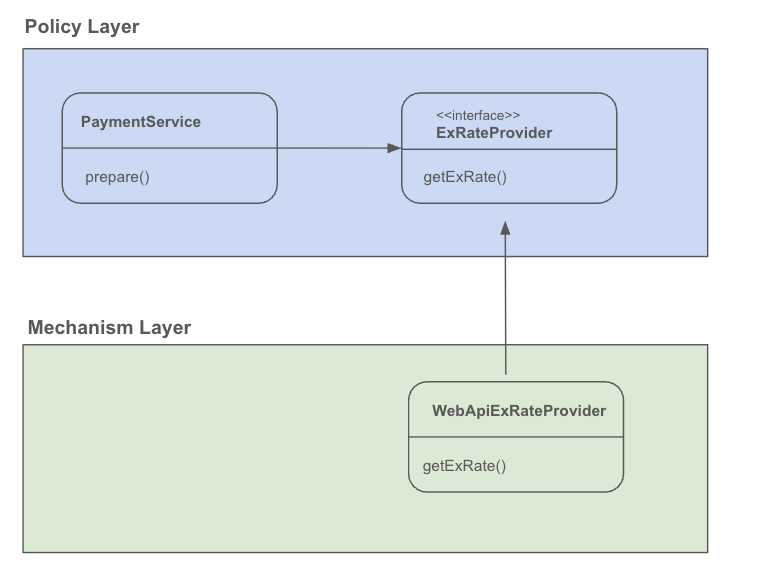

# spring 6 

## 오브젝트와 의존관계

- 스프링의 관심은 오브젝트이다.
- 클래스와 오브젝트는 다르다.
- 자바의 오브젝트는 클래스의 인스턴스 또는 배열이다.

### OOP

- OOP (Object-Oriented Programming) : 객체 지향 프로그래밍
- 객체 (Object) : 데이터(속성)와 행동(메서드)을 가진 독립된 단위
    - 실제 프로그램에서 독립된 단위로서 행동하는 것
    - 클래스의 인스턴스 = Object, 객체
    - 자바에서는 배열(Array) 도 오브젝트이다.
- 클래스 (Class) : 객체를 만들어내기 위한 설계도, 객체는 클래스의 인스턴스
    - Object 를 만들기 위한 것
    - 프로그래머가 코딩하는 단위, 클래스 파일
- 캡슐화 (Encapsulation) : 데이터와 메서드를 하나로 묶고, 외부에서 직접 접근하지 못하게 보호
- 상속 (Inheritance) : 기존 클래스의 기능을 물려받아 새로운 클래스를 만들 수 있음
- 다형성 (Polymorphism) : 같은 이름의 메서드가 상황에 따라 다르게 동작할 수 있음

### 다형성의 예시

```jsx
class Animal {
    void sound() {
        System.out.println("동물이 소리를 낸다");
    }
}

class Dog extends Animal {
    void sound() {
        System.out.println("멍멍!");
    }
}

```

### 의존관계

- A와 B가 있을 때, A가 B에 의존한다 라고 하게 됨
- Client → Supplier
    - Client 의 기능이 제대로 동작하려면 Supplier 가 필요
    - Client 가 Supplier 를 사용, 호출, 생성, 인스턴스화, 전송
    - 클래스 레벨(코드 레벨) 의 의존관계, Supplier 가 변경되면 Client 코드가 영향을 받는다.
    - *클래스 레벨의 의존관계와 런타임 때의 의존관계가 다를 수 있다.*
- 의존관계는 반드시 두 개 이상의 대상이 존재하고, 하나가 다른 하나를 사용, 호출, 생성, 인스턴스화, 전송 등을 할 때 의존관계에 있다고 이야기한다.
- 클래스 사이에 의존관계가 있을 때 의존 대상이 변경되면 이를 사용하는 클래스의 코드도 영향을 받는다.
- 오브젝트 사이에 의존관계는 실행되는 런타임에 의존관계가 만들어지고 실행 기능에 영향을 받지만 클래스 레벨의 의존관계는 다를 수 있다.
- https://www.ibm.com/docs/en/dmrt/9.5?topic=diagrams-dependency-relationships

<br />

### 관심사의 분리

- 관심사는 동일한 이유로 변경되는 코드의 집합
- API 를 이용해서 환율정보를 가져오고 JSON 을 오브젝트에 매핑하는 관심과 Payment 를 준비하는 로직은 관심이 다르다. 변경의 이유와 시점을 살펴보고 이를 분리한다.

<br />

### 메소드 추출 리팩터링

- https://refactoring.guru/extract-method
- https://martinfowler.com/books/refactoring.html
- https://refactoring.guru/ko/design-patterns

<br />

### 기존


- PaymentService 는 환율 정보를 가져와 계산하는 비즈니스 로직을 가지고 있다.
- getExRate() 는 고정 환율을 사용할 것인지, 외부 API 의 환율정보를 가져와 사용할 것인지 경우가 나눠진다.
- 이때 if 문으로 분기처리, 상속으로 다중 클래스가 아닌 인터페이스 추상화를 사용하였다.
- 그리고 추상화 때 구현체를 결정하고 생성하는 주체는 PaymentService 가 아닌 ObjectFactory 에서 결정한다.
- ObjectFactory 는 Client 클래스에서 애플리케이션을 구동할 때 생성되며, 그때 작성된 코드 기반으로 구현체를 선택한다.


<br />

### 스프링


### 스프링의 빈 팩토리

- Bean
  - Java 의 빈, 자바에서 컴포넌트 오브젝트를 의미하며, 오브젝트라고 생각해도 된다.
  - 애플리케이션을 구성하는 기능을 담당하고 제공하는 오브젝트를 의미
  - 오브젝트 팩토리 = 빈 팩토리 → 스프링의 빈 팩토리를 사용
- Spring 의 Bean Factory
  - 스프링의 빈 팩토리는 애플리케이션 내부 로직 (PaymentService) 와 같은 로직을 알지 못한다.
- 위의 ObjectFactory 를 Spring Bean 으로 등록한다.
- Client 가 애플리케이션을 실행할 때 Spring 에서 알아서 빈으로 등록된 객체를 생성하고 주입시켜준다.
- 실제 WebApiExRateProvider 를 생성하고자 할 때 PaymentService 에서 객체를 생성하고 사용한 것이 아닌 외부의 스프링에서 생성되고 주입받았기 때문에 제어의 역전이라 한다.
- DI 가 필요한 이유는 매번 요청이 들어올때마다 클래스 객체를 생성하게 되면 대용량 트래픽이 왔을 때의 자원 낭비가 심하다. 그렇기 때문에 애플리케이션에서 처음 시작할 때 필요한 객체들은 단 한번만 생성해서 스프링 빈 팩토리에 등록하고, 그 이후에 사용하는 것이 효율적이기 때문이다.
  DI 는 이러한 구조를 프레임워크 툴로서 제시한다.
- PaymentService , WebApiExRateProvider 에서는 어떤 상태 정보를 저장하지 않기 때문에 여러 쓰레드에서 동시에 빈에 접근해도 괜찮다. 그렇기 때문에 Object 를 하나만 만들어서 사용해도 된다.
- 서블릿 : 서블릿 컨테이너 위에서 만들어지고 사용된다.
  - 톰캣으로부터 요청이 들어옴
  - 서블릿 컨테이너에서 오브젝트를 가져와서 요청을 수행한다.

<br />

### POJO


- POJO (Plain Old Java Object)
  - 아무런 특별한 규약이나 프레임워크에 의존하지 않는 순수한 Java 객체
  - 단순한 필드, getter/setter, 생성자, 메서드만 가짐
  - User, Order, Product 등 도메인 객체

- Business 로직을 개발한 클래스는 순수 Java 객체로 만듬
- 실제 런타임에서 의존성을 주입하는 부분은 스프링 프레임워크 기능을 사용함
- POJO 와 Spring Framework 부분이 결합되서 실제 운용되는 애플리케이션이 됨

<br />

### 싱글톤 레지스트리 (Singleton Registry)

- 스프링이 스스로의 정체성을 싱글톤 레지스트리
- 애플리케이션에서 하나의 오브젝트만 생성해서 공유하는 경우


<br />

### DI와 디자인패턴


- Design Patterns : Elements of Reusable Object-Oriented Software

- 패턴을 목적과 범위로 구분함
  - Class : 상속 → 클래스 상속을 통한 확장은 클래스가 n*n 으로 많아지는 단점이 있음
  - Object : 합성 → Object 2개를 만들어서 Runtime 환경에 의존관계를 주입하는 방법

- Object 합성을 이용하는 디자인 패턴을 적용할 때 스프링의 의존관계 주입(Dependency Injection)을 사용

### 환율 정보가 필요할 때 매번 Web API 를 호출해야 할까?

- 환율 정보가 필요한 기능 증가
- 응답시간
- 환율 변동 주기

### WebApiExRateProvider 에 캐시 기능 추가

- A) WebApiExRateProvider 코드 수정
- B) 데코레이터(Decorator) 디자인 패턴
  - 오브젝트에 부가적인 기능/책임을 동적으로 부여한다.


<br />

## 의존성 역전 원칙 (Dependency Inversion Principle )

- ***상위 수준의 모듈은 하위 수준의 모듈에 의존해서는 안된다.*** 둘 모두 추상화에 의존해야 한다.
- 추상화는 구체적인 사항에 의존해서는 안된다. 구체적인 사항은 추상화에 의존해야 한다.
- 모듈은 패키지 단위로 구분될 수 있고, Jar 파일 단위로도 구분될 수 있다.


- 상위 모듈인 PaymentService 도 인터페이스를 통해 주입받고 있고, 하위 모듈인 WebApiExRateProvider 도 인터페이스를 통해 주입받고 있다.
- 그러나 현재 소스 상 PaymentService 에서는 하위 모듈의 ExRateProvider 인터페이스를 의존하고 있기 때문에 의존성 역전 원칙에 위배된다.
- 따라서 인터페이스 소유권의 역전이 필요하다.
  - Separated Interface 패턴



- 인터페이스 소유권을 상위모듈로 이전한 그림
- 상위 모듈은 하위 모듈에 의존하지 않을 수 있게 됨
- 상위 모듈에서 구현이 필요한 메서드를 인터페이스를 통해 제시할 수 있게 됨으로써 하위모듈 제작에 도움을 줌

```java
@Component
public class PaymentService {

    // final : 한번 할당한 뒤 변경하지 못하게 하는 것
    private final ExRateProvider exRateProvider;
    private final Clock clock;

    public PaymentService(ExRateProvider exRateProvider, Clock clock) {
        // 인스터의 구현체를 주입함
        // paymentService -> WebApiExtRateProvider 를 의존하게 되어 있음 (RunTime 에서의 의존관계)
        // RunTime 에 내가 어떤 클래스를 쓰는 건지 필요하기 때문에 의존
        // 이는 생성자를 통해 어떤 구현체를 선택하는지가 나타나있음, 관계 설정 책임의 분리
        // 따라서 구현체는 Client 클래스에서 생성해서 주입해주고, 이 클래스는 인터페이스를 받아서 사용하면 된다.
        // this.exRateProvider = new WebApiExtRateProvider();
        this.exRateProvider = exRateProvider;
        this.clock = clock;
    }

    // java 는 HTTP 를 어떻게 다룰까? -> 블로그 주제?
    public Payment prepare(Long orderId, String currency, BigDecimal foreignCurrencyAmount) throws IOException {


        BigDecimal exRate = this.exRateProvider.getExRate(currency);

        // 위의 로직과 아래의 로직은 관심사가 다르다.
        // 위의 로직은 환율 정보를 가져오는 로직으로, 가져오는 API 에 대한 변경에 대한 요인으로 변경된다.
        // 그러나 아래의 로직은 우리 서비스 내에서 환율을 계산하는 로직이 변경될 때 변경된다.
        // 따라서 두 로직은 다른 시점에서 다른 이유로 변경되기 때문에 분리되는 것이 적합하다.

         BigDecimal convertedAmount = foreignCurrencyAmount.multiply(exRate);
        // 시계의 종류에 따라 현재시간으로부터 경과한 시간을 의미함
         LocalDateTime validUntil = LocalDateTime.now(clock).plusMinutes(30);

        // 상속은 상위 클래스와 하위 클래스가 강하게 결합되어 있음
        // 상속된 클래스가 변경이 되면 분기처리를 위해 여러 클래스들을 만들어야 한다.
        // 예를 들어 환율에 혜택을 부여한다고 가정했을 때, simpleRate, webRate * 혜택 o,x 별로 늘어나게 된다.
        return new Payment(orderId, currency, foreignCurrencyAmount, exRate, convertedAmount, validUntil);
    }
}
```


<br />


# 테스트

### 개발자가 만드는 테스트

- 개발한 코드에 대한 검증 기능을 코드로 작성한다.
- 자동으로 테스트를 수행하고 결과를 확인한다.
- 테스팅 프레임워크를 활용한다.
- 테스트 작성과 실행도 개발 과정의 일부이다.


<br />

### JUnit 5

- @Test 테스트 메소드
- @BeforeEach 테스트
- 각 테스트 전에 실행된다.
- 테스트마다 새로운 인스턴스가 만들어진다.

```jsx

// WebApiExtRateProvider 서비스에 의존적인 테스트 코드, 외부 시스템에 문제가 생기면?
// ExRateProvider 가 제공하는 환율 값으로 계산한 것인지 모름
// 환율 유효 시간 계산이 정확한지 모름
@Test
@DisplayName("prepare 메소드가 요구사항 3가지를 충족했는지 검사")
void prepareByWebApiExtRateProvider() throws IOException {

    // given
    PaymentService paymentService = new PaymentService(new WebApiExtRateProvider(), this.clock);

    // when
    Payment payment = paymentService.prepare(1L, "USD", BigDecimal.TEN);

    // then

    // 환율정보를 가져온다.
    assertThat(payment.getExRate()).isNotNull();

    // 원화환산 금액 계산
    // 환율 * 외환금액 = 원화환산금액
    assertThat(payment.getConvertedAmount())
            .isEqualTo(payment.getExRate().multiply(payment.getForeignCurrencyAmount()));

    // 원화환산금액의 유효시간
    assertThat(payment.getValidUntil()).isAfter(LocalDateTime.now());
    assertThat(payment.getValidUntil()).isBefore(LocalDateTime.now().plusMinutes(30));
}
```


<br />

## 테스트의 구성요소

- 테스트 대상 (SUT) system under test
- 협력자 : Collaborator

<br />

### Learning Test

- 직접 만들지 않은 코드, 라이브러리, 레거시 시스템에 대한 테스트
- 테스트 대상의 사용방법을 익히고 동작방식을 확인하는데 유용하다.
- 외부 기술, 서비스가 버전이 올라갔을 때 이전과 동일하게 동작하는지 확인할 수 있다.

<br />

### 도메인 모델 아키텍처 패턴

- 도메인 로직, 비즈니스 로직을 어디에 둘 지를 결정하는 패턴
  - 트랜잭션 스크립트 - 서비스 메소드 (PaymentService.prepare)
  - 도메인 모델 - 도메인 모델 오브젝트 (Payment)

<br />

# 템플릿

## 개방 폐쇄 원칙

- 클래스나 모듈은 확장에는 열려 있어야 하고 변경에는 닫혀 있어야 한다.
- 변화의 특성이 다른 부분을 구분하고 각각 다른 목적과 이유에 의해 다른 시점에 독립적으로 변경될 수 있는 효율적인 구조를 만들어야 한다.

<br />

## 템플릿

- 코드 중에서 변경이 거의 일어나지 않으며 일정한 패턴으로 유지되는 특성을 가진 부분을 자유롭게 변경되는 성질을 가진 부분으로부터 독립시켜서 효과적으로 활용할 수 있도록 하는 방법
  - 템플릿 : 변경이 거의 일어나지 않는 부분
  - 콜백 : 자유롭게 변경되는 성질을 가진 부분
- 어떤 목적을 위해 미리 만들어둔 모양이 있는 틀
- 고정된 틀 안에 바꿀 수 있는 부분을 넣어서 사용하도록 만들어진 오브젝트
- 템플릿 메서드 패턴도 템플릿 사용

<br />

### 템플릿 메소드 패턴

- 템플릿 메소드 패턴은 고정된 틀의 로직을 가진 템플릿 메소드를 슈퍼클래스에 두고, 바뀌는 부분을 서브클래스의 메소드에 두는 구조로 이루어짐

<br />

### 콜백(callback)

- 콜백(callback) 은 실행되는 것을 목적으로 다른 오브젝트의 메소드에 전달되는 오브젝트 파라미터로 전달되지만 값을 참조하기 위한 것이 아니라 특정 로직을 담은 메소드를 실행시키는 것이 목적
- 하나의 메소드를 가진 인터페이스 타입(SAM)의 오브젝트 또는 람다 오브젝트

<br />

### 템플릿/콜백은 전략 패턴의 특별한 케이스

- 템플릿은 전략 패턴의 컨텍스트
- 콜백은 전략 패턴의 전략
- 템플릿/콜백은 메소드 하나만 가진 전략 인터페이스를 사용하는 전략 패턴

<br />

### 메소드 주입

- 의존 오브젝트가 메소드 호출 시점에 파라미터로 전달되는 방식
- 의존관계 주입의 한 종류
- 메소드 호출 주입(method call injection)이라고도 한다.


<br />

### WebApiExRateProvider 의 구성

- URI 를 준비하고 예외처리를 위한 작업을 하는 코드
  - API 로부터 환율 정보를 가져오는 코드의 기본 틀 (잘 변경되지 않음)
- API 를 실행하고, 서버로부터 받은 응답을 가져오는 코드
  - API 를 호출하는 기술과 방법이 변경될 수 있음
- JSON 문자열을 파싱하고 필요한 환율 정보를 추출하는 코드


<br />

### 람다 식으로 익명클래스 작성하기

```shell
@Override
public BigDecimal getExRate(String currency) {
    String url = "https://open.er-api.com/v6/latest/" + currency;

    return runAPIExRate(url, new SimpleApiExecutor(), response -> {
        ObjectMapper mapper = new ObjectMapper();
        ExRateData data = mapper.readValue(response, ExRateData.class);
        BigDecimal exRate = data.rates().get("KRW");
        System.out.println("API ExRate: " + exRate);
        return exRate;
    });
}
```
- 위와 같이 response 에서 값을 추출하는 로직을 익명클래스 형태로 구현할 수 있다.

<br />

## 예외

- 예외는 정상적인 프로그램 흐름을 방해하는 사건
- 예외적인 상황에서만 사용
- 많은 경우 예외는 프로그램 오류, 버그 때문에 발생

<br />

### 예외가 발생하면

- 예외 상황을 복구해서 정상적인 흐름으로 전환할 수 있는가
  - 재시도
  - 대안
- 버그인가?
  - 예외가 발생한 코드의 버그인가
  - 클라이언트의 버그인가
  - 제어할 수 없는 예외상황인가

<br />

### 예외의 종류

- Error
  - 시스템에 비정상적인 상황 발생
  - OutOfMemoryError
  - ThreadDeath
- Exception (checked)
  - catch 나 throws 를 강요
  - 초기 라이브러리의 잘못된 예외 설계/사용
  - 복구할 수 없다면 RuntimeException 이나 적절한 추상화 레벨의 예외로 전환해서 던질 것
- RuntimeException (unchecked)

<br />

### 예외의 추상화와 전환

- 사용 기술에 따라 같은 문제에 대해 다른 종류의 예외 발생
- 적절한 예외 추상화와 예외 번역이 필요

<br />

### JPA 예시


- DataSource : 애플리케이션 시작 시 한번 생성되며 DB 와 Java 를 연결해줌, 명령어 생성 및 수행은 JDBC
- EntityManager : 주문 생성 시 매번 생성되는 객체, JavaObject 형태이며 DB 에 저장되는 객체를 의미함
- Order : 테이블 정의
- OrderRepository : DB 와 관련된 작업을 담당하는 오브젝트
- EntityManagerFactory : EntityManager 생성하는 주체

<br />

```jsx
public void save(Order order) {

        // em
        EntityManager em = emf.createEntityManager();

        // transaction
        EntityTransaction transaction = em.getTransaction();

        transaction.begin();

        try {
            em.persist(order);
            em.flush();

            // em.persist
            transaction.commit();
        } catch (RuntimeException e) {
            if (transaction.isActive()) {
                transaction.rollback();
            }
            throw e;
        } finally {
            if (em.isOpen()) {
                em.close();
            }
        }
}
```

- JPA 내부적으로 동작하는 로직

## 스프링 데이터 액세스 예외처리

JDBC SQLException

- JDBC 를 기반으로 하는 모든 기술에서 발생하는 예외
- JDBC, MyBatis, JPA, …
- DB 의 에러코드에 의존하거나, 데이터 기술에 의존적인 예외처리 코드

DataAccessException

- 에러를 추상화
- DB 의 에러코드와 데이터 액세스 기술에 독립적인 예외 구조
- 적절한 예외 번역(exception translation) 도구를 제공


```java
public class DataClient {
    public static void main(String[] args) {
        BeanFactory beanFactory = new AnnotationConfigApplicationContext(DataConfig.class);
        OrderRepository orderRepository = beanFactory.getBean(OrderRepository.class);
        JpaTransactionManager transactionManager = beanFactory.getBean(JpaTransactionManager.class);

        try {
            new TransactionTemplate(transactionManager).execute(status -> {
                // transaction begin
                Order order = new Order("100", BigDecimal.TEN);
                orderRepository.save(order);

                System.out.println(order);

                Order order2 = new Order("100", BigDecimal.TEN);
                orderRepository.save(order2);
                System.out.println(order2);

                return null;
            });
        } catch (DataIntegrityViolationException e) {
            System.out.println("주문번호 중복 복구 작업");
        }
    }
}
```

- TransactionTemplate 을 활용한 Sample Code

```java
public class OrderRepository {

    @PersistenceContext
    private EntityManager em;

    public void save(Order order) {
        em.persist(order);
    }
}

```
- OrderRepository 는 Spring Bean 의 EntityManager 를 로드하여 persist 하는 역할만 함
- 나머지 트랜잭션, 롤백처리는 TransactionTemplate 에서 기능을 수행함

<br />

## 스프링 애플리케이션의 빈이 존재하는 계층 구조

- 3개의 전형적인 (stereotype) 애노테이션을 사용하는 애플리케이션 빈의 위치


<br />

### 서비스

- 클라이언트에게 서비스를 제공해주는 오브젝트나 모듈
- 서비스는 일반적으로 상태를 가지지 않음
  - 상태없는 (stateless) 싱글톤 스프링 빈을 사용하기 적합
  - @Component, @Service

<br />

### 서비스의 종류

- 애플리케이션 서비스 (application service)
  - @Service 빈으로 구성
  - Application/Service 계층에 존재
  - 애플리케이션/도메인 로직 - 도메인 오브젝트/엔티티 활용
  - 인프라 서비스의 도움
  - 가장 중요한 도메인/애플리케이션/비즈니스 로직
  - 인프라 레이어에 존재하는 기술에 가능한 의존하지 않도록 만들어야 함
  - PaymentService -ExRateService 에 적용된 DIP
- 도메인 서비스 (domain service)
- 인프라 서비스 (infrastructure service)
  - 도메인/애플리케이션 로직에 참여하지 않는 기술을 제공하는 서비스
  - 메일, 캐시, 트랜잭션, 메시징 등

<br />


### Order 에서 JPA 메타데이터 분리

- 애노테이션 (@Entity) 은 컴파일타임 라이브러리 의존성만 가진다.
- 엔티티의 동작에는 영향을 주지 않기 때문에 엔티티 클래스를 다른 데이터 기술에서 사용해도 된다.
- 그래도 제거하고 싶다면 외부 XML 디스크립터를 사용할 수 있다.
  - META-INF/orm.xml

<br />

### 트랜잭션 서비스 추상화

- 트랜잭션은 데이터 기술에 따라 방법이 다르다
  - JDBC, JPA, MyBatis, Jooq

<br />

### 추상화

- 구현의 복잡함과 디테일을 감추고 중요한 것만 남기는 기법
- 여러 인프라 서비스 기술의 공통적이고 핵심적인 기능을 인터페이스로 정의하고 이를 구현하는 어댑터를 만들어 일관된 사용이 가능하게 만드는 것이 서비스 추상화

<br />


```java
@Configuration
public class DataConfig {

    // data source
    @Bean
    public DataSource dataSource() {
        return new EmbeddedDatabaseBuilder().setType(EmbeddedDatabaseType.H2).build();
    }

    // entity manager factory
    @Bean
    public LocalContainerEntityManagerFactoryBean entityManagerFactory() {
        LocalContainerEntityManagerFactoryBean emf = new LocalContainerEntityManagerFactoryBean();
        emf.setDataSource(dataSource());
        emf.setPackagesToScan("io.gig.spring6");
        emf.setJpaVendorAdapter(new HibernateJpaVendorAdapter() {{
            setDatabase(Database.H2);
            setGenerateDdl(true);
            setShowSql(true);
        }});

        return emf;
    }

    @Bean
    public BeanPostProcessor persistenceAnnotationBeanPostProcessor() {
        return new PersistenceAnnotationBeanPostProcessor();
    }

    @Bean
    public PlatformTransactionManager transactionManager(LocalContainerEntityManagerFactoryBean factoryBean) {
        EntityManagerFactory emf = factoryBean.getObject();
        return new JpaTransactionManager(emf);
    }
}
```

- 추상화 후 JpaTransactionManager -> PlatformTransactionManager 로 변경


<br />


## JDBC 데이터 액세스 기술

### JDBC Client

- Spring 6.1 에서 추가
- SQL을 사용하는 JDBC 데이터 처리 코드를 유연하게 작성하도록 도와줌
- 일종의 템플릿/콜백
- 스프링의 JdbcTemplate 의 대체 기술

<br />

### DataSourceTransactionManager

- JDBC 의 Connection 을 이용하는 트랜잭션 매니저
- Connection 을 리턴하는 DataSource 오브젝트 필요

<br />
